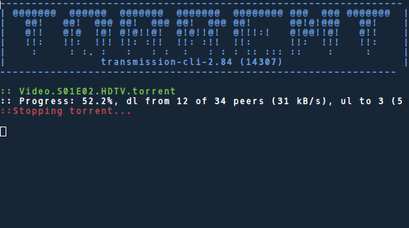

Legacy
=======

"Keep calm on code on"

Welcome to legacy, 
place for all of my personal patches, old stuff I found useful, and more.

Legacy projects
================

* eagle-whois - I wrote "eagle" long time ago but i'm still using it.

Patches
========

* Apply any patch with `patch -p1 < [path]`

1. transmission284_awesome.patch

> the transmission-cli patch makes transmission-cli awesome!

[!] Please compile transmission with `./configure --disable-nls`

Copying
==========

Copyright (c) 2015 by Hypsurus.
License GPLv3+: GNU GPL version 3 or later <http://gnu.org/licenses/gpl.html>.

